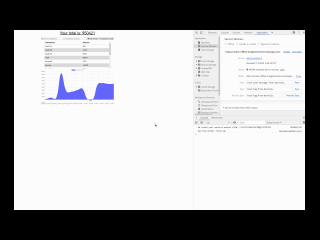

# Budget Tracker - Online/Offline

## Description

A small web based budget tracker that will work both online and offline. If the user goes offline during use, the app will automatically update when an online status is detected.

## Table of Contents

- [User Story](#User%20Story)
- [Build Status](#Build%20Status)
- [Technology](#Code%20Style%20and%20Technology)
- [Use](#Usage)
- [Download](#Download)
- [Credits](#Credits)
- [Screenshots](#Screenshots)

# User Story

```
AS AN avid traveller
I WANT to be able to track my withdrawals and deposits with or without a data/internet connection
SO THAT my account balance is accurate when I am traveling
```

# Build Status

Passed testing on 1st July 2020

# Code Style and Technology

This has been developed with react, HTML5, CSS3, Javascript, Node.js, express, mongoDB utilizing Visual Studio Code
Additional NPM packages: express
node_modules folder has been added to .gitignore

# Use

Application can be executed from the following URL:

https://online-offline-budgetrechner.herokuapp.com/

# Download

The source for this app can be downloaded here:

https://github.com/SaundersEddie/Note-Taker

# Credits

Javascript Coding - Eddie Saunders (https://github.com/SaundersEddie)
Front end code and design - Trilogy

# Demo


